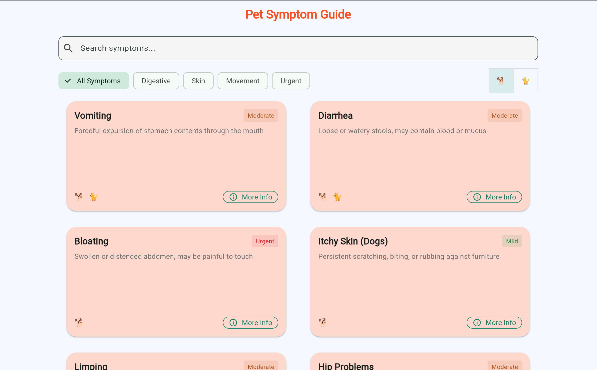
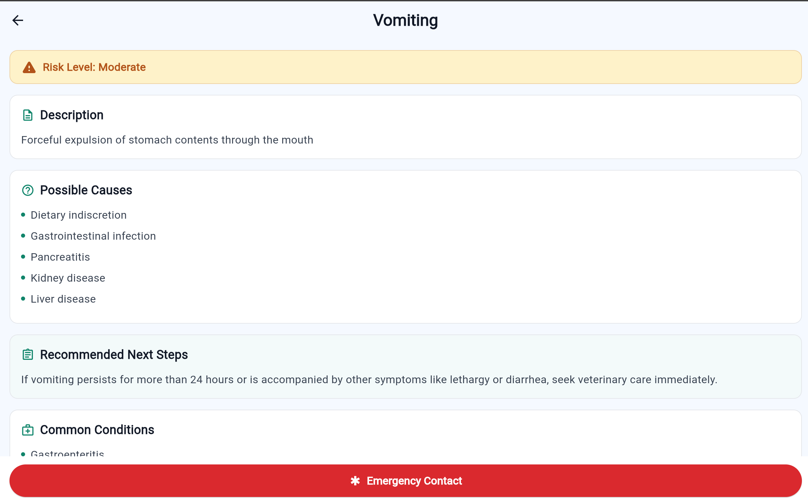

# Pet Symptom Guide

A Flutter application designed to help pet owners identify and understand common symptoms in dogs and cats. Built with Flutter and integrating with the Infermedica API, this app provides a comprehensive guide for pet health monitoring.

## Screenshots

### List Screen

*Main screen showing the list of symptoms with search, filtering, and risk level indicators*

### Detail Screen

*Detailed view of a symptom showing risk level, description, causes, and recommended steps*

## Key Features

### Core Functionality
- **Symptom Browsing**: Browse through a comprehensive list of common pet symptoms
- **Detailed Information**: Access detailed information about each symptom including:
  - Risk level assessment (Mild, Moderate, Urgent)
  - Possible causes
  - Recommended next steps
  - Related symptoms
  - Common conditions

### User Interface
- **Intuitive Navigation**
  - Category-based filtering (Digestive, Skin, Movement, Urgent)
  - Pet type switching between dogs and cats (🐕/🐈)
  - Search functionality for quick symptom lookup
  - Risk level indicators with color coding:
    - Mild: Green
    - Moderate: Amber
    - Urgent: Red
  - Emergency contact button for urgent cases

### Smart Features
- **Intelligent Filtering**
  - Pet-specific symptom display
  - Category-based organization
  - Risk level classification
- **Search Capabilities**
  - Real-time search results
  - Search across symptom names and descriptions
  - Category-aware search results

## Technical Implementation

### Architecture
```
lib/
├── models/
│   ├── symptom.dart         # Data models for symptoms
│   └── enums/              # Enums for risk levels and pet types
├── repositories/
│   └── symptom_repository.dart  # Data access layer with caching
├── services/
│   └── infermedica_api_service.dart  # API integration service
├── screens/
│   ├── symptom_list_screen.dart    # Main list view
│   └── symptom_detail_screen.dart  # Detailed symptom view
└── main.dart               # App entry point
```

### Key Components
- **SymptomRepository**: Implements singleton pattern for centralized data management
- **InfermedicaApiService**: Handles API integration (simulated in current version)
- **Symptom Model**: Comprehensive data model for symptom information
- **Risk Level System**: Three-tier classification (Mild, Moderate, Urgent)

### Data Management
- In-memory caching for improved performance
- Efficient filtering and search algorithms
- Mock data implementation for development
- Prepared for API integration

## Getting Started

### Prerequisites
- Flutter SDK (latest version)
- Dart SDK (latest version)
- A code editor (VS Code, Android Studio, or IntelliJ)

### Installation
1. Clone the repository:
   ```bash
   git clone https://github.com/XueqiTao/pet_symptom_guide.git
   cd pet_symptom_guide
   ```

2. Install dependencies:
   ```bash
   flutter pub get
   ```

3. Run the application:
   ```bash
   flutter run
   ```

### Development Setup
- Enable Flutter web support:
  ```bash
  flutter config --enable-web
  ```
- For Chrome debugging:
  ```bash
  flutter run -d chrome --web-renderer html
  ```

## Project Structure
- `lib/models/`: Data structures and business logic
- `lib/repositories/`: Data access and caching layer
- `lib/screens/`: UI components and screens
- `lib/services/`: External service integrations
- `web/`: Web-specific configurations and assets
- `assets/`: Images and other static resources

## Future Enhancements
- [ ] Real API integration with Infermedica
- [ ] Offline support with local storage
- [ ] User accounts for saving symptom history
- [ ] Multi-language support
- [ ] Dark mode support
- [ ] Push notifications for symptom tracking
- [ ] Integration with veterinary telemedicine services

## Contributing
Contributions are welcome! Please feel free to submit a Pull Request.

## License
This project is licensed under the MIT License - see the LICENSE file for details.

## Acknowledgments
- Flutter team for the excellent framework
- Infermedica API for the medical knowledge base
- Contributors and maintainers

## Support
For support, please open an issue in the repository or contact the maintainers.
